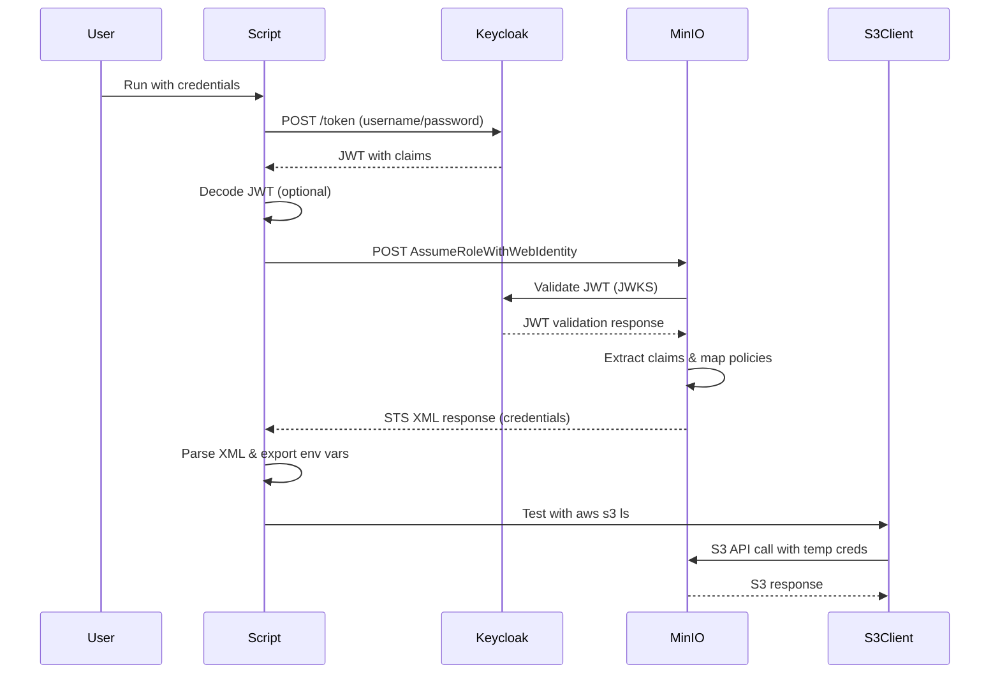

# Architecture Deep Dive

## 🏗️ Technical Architecture

### Overview
This solution implements a programmatic OIDC authentication flow that bypasses the deprecated MinIO Console OIDC login while maintaining full compatibility with AWS S3 APIs.

### Components

#### 1. Keycloak (Identity Provider)
- **Role**: OIDC Identity Provider
- **Responsibilities**:
  - User authentication
  - JWT token generation
  - Group/role management
  - Claims mapping

#### 2. MinIO (Object Storage + STS)
- **Role**: S3-compatible storage with AWS STS implementation
- **Responsibilities**:
  - JWT token validation
  - Policy enforcement
  - Temporary credential generation
  - S3 API serving

#### 3. Authentication Script
- **Role**: OIDC client and credential manager
- **Responsibilities**:
  - Direct Keycloak authentication
  - JWT token exchange
  - AWS credential extraction
  - Environment setup

## 🔄 Authentication Flow

### Detailed Sequence



### Step-by-Step Breakdown

#### Step 1: Direct Authentication
```bash
curl -X POST "https://keycloak.example.com/auth/realms/minio/protocol/openid-connect/token" \
  -d "client_id=minio-client" \
  -d "client_secret=xxx" \
  -d "username=john.doe" \
  -d "password=xxx" \
  -d "grant_type=password"
```

**Response:**
```json
{
  "access_token": "eyJhbGciOiJSUzI1NiIsInR5cCI6IkpXVCJ9...",
  "expires_in": 300,
  "token_type": "Bearer"
}
```

#### Step 2: JWT Claims Structure
```json
{
  "iss": "https://keycloak.example.com/auth/realms/minio",
  "sub": "user-uuid",
  "preferred_username": "john.doe",
  "email": "john.doe@example.com",
  "policy": ["AdminPolicy", "ReadWritePolicy"],
  "groups": ["/Admins", "/Users"],
  "exp": 1704067200,
  "iat": 1704066900
}
```

#### Step 3: STS Token Exchange
```bash
curl -X POST "https://minio-api.example.com" \
  -d "Action=AssumeRoleWithWebIdentity" \
  -d "Version=2011-06-15" \
  -d "DurationSeconds=3600" \
  -d "WebIdentityToken=eyJhbGciOiJSUzI1NiIsInR5cCI6IkpXVCJ9..."
```

**Response:**
```xml
<AssumeRoleWithWebIdentityResponse>
  <AssumeRoleWithWebIdentityResult>
    <Credentials>
      <AccessKeyId>ASIATESTACCESSKEY</AccessKeyId>
      <SecretAccessKey>testsecretkey</SecretAccessKey>
      <SessionToken>longsessiontoken...</SessionToken>
      <Expiration>2024-01-01T13:00:00Z</Expiration>
    </Credentials>
  </AssumeRoleWithWebIdentityResult>
</AssumeRoleWithWebIdentityResponse>
```

## 🔒 Security Model

### JWT Validation Process

1. **MinIO receives JWT** in AssumeRoleWithWebIdentity request
2. **Fetches JWKS** from Keycloak's `/.well-known/openid-configuration`
3. **Validates signature** using public keys from JWKS
4. **Checks expiration** and other standard JWT claims
5. **Extracts custom claims** (policy, groups)
6. **Maps to MinIO policies** based on `claimName` configuration

### Policy Mapping

MinIO uses the `policy` claim to determine user permissions:

```yaml
# MinIO configuration
oidc:
  claimName: "policy"  # JWT claim containing policy names
```

```json
// JWT payload
{
  "policy": ["AdminPolicy", "ReadWritePolicy"]
}
```

MinIO grants the **union** of all policies listed in the claim.

### Temporary Credentials

- **Validity**: 1 hour (configurable via `DurationSeconds`)
- **Scope**: Limited to policies mapped from JWT claims
- **Format**: Standard AWS credentials (AccessKey + SecretKey + SessionToken)
- **Usage**: Compatible with all AWS SDKs and tools

## 🔧 MinIO Configuration Details

### OIDC Settings
```yaml
oidc:
  enabled: true
  configUrl: "https://keycloak.example.com/auth/realms/minio/.well-known/openid-configuration"
  clientId: "minio-client"
  existingClientSecretName: "minio-oidc-secret"
  existingClientSecretKey: "client-secret"
  claimName: "policy"
  scopes: "openid,profile,email,groups"
  comment: "OIDC Authentication"
```

### Policy Definitions
```yaml
policies:
  - name: AdminPolicy
    statements:
      - effect: Allow
        resources: ['arn:aws:s3:::*', 'arn:aws:s3:::*/*']
        actions: ["s3:*"]
  
  - name: ReadWritePolicy
    statements:
      - effect: Allow
        resources: ['arn:aws:s3:::data/*']
        actions: ["s3:GetObject", "s3:PutObject", "s3:DeleteObject"]
      - effect: Allow
        resources: ['arn:aws:s3:::data']
        actions: ["s3:ListBucket"]
```

## 🔍 Keycloak Configuration Details

### Client Configuration
- **Client Type**: Confidential
- **Access Type**: Direct Access Grants Enabled
- **Valid Redirect URIs**: `https://minio-console.example.com/oauth_callback`
- **Web Origins**: `https://minio-console.example.com`

### Protocol Mappers
1. **Groups Mapper**:
   - Maps user groups to `policy` claim
   - Used by MinIO for policy assignment

2. **Username Mapper**:
   - Maps username to `preferred_username` claim
   - Used for audit logging

### Group Structure
```
/Admins          → AdminPolicy
/Users           → ReadWritePolicy
/ReadOnly        → ReadOnlyPolicy
```

## 🚀 Performance Considerations

### Caching
- **JWKS Caching**: MinIO caches Keycloak's public keys
- **Policy Caching**: MinIO caches policy definitions
- **Token Validation**: Minimal overhead after initial JWKS fetch

### Scalability
- **Stateless**: No session state stored
- **Distributed**: Works with MinIO distributed deployments
- **Load Balancing**: Compatible with load balancers

### Network Calls
1. **Script → Keycloak**: 1 call (token request)
2. **Script → MinIO**: 1 call (STS request)
3. **MinIO → Keycloak**: 1 call (JWKS fetch, cached)

Total: 3 network calls for authentication

## 🔄 Comparison with Alternatives

### vs. MinIO Console OIDC (Deprecated)
| Feature | Console OIDC | This Solution |
|---------|--------------|---------------|
| Browser Required | ✅ Yes | ❌ No |
| Programmatic | ❌ No | ✅ Yes |
| AWS Compatible | ❌ No | ✅ Yes |
| Enterprise Only | ✅ Yes | ❌ No |
| Maintenance | 🔴 Deprecated | ✅ Active |

### vs. MinIO Service Accounts
| Feature | Service Accounts | This Solution |
|---------|------------------|---------------|
| User Identity | ❌ Service | ✅ User |
| OIDC Integration | ❌ No | ✅ Yes |
| Centralized Auth | ❌ No | ✅ Yes |
| Temporary Creds | ❌ No | ✅ Yes |
| Audit Trail | 🟡 Limited | ✅ Full |

### vs. Direct MinIO Credentials
| Feature | Direct Creds | This Solution |
|---------|--------------|---------------|
| Rotation | 🟡 Manual | ✅ Automatic |
| Centralized | ❌ No | ✅ Yes |
| Temporary | ❌ No | ✅ Yes |
| RBAC | 🟡 Basic | ✅ Advanced |
| SSO | ❌ No | ✅ Yes |

## 🎯 Use Cases

### Development Teams
- **Scenario**: Developers need S3 access for testing
- **Benefit**: Use existing company SSO, no shared credentials

### CI/CD Pipelines
- **Scenario**: Automated deployments need S3 access
- **Benefit**: Short-lived credentials, audit trail

### Data Scientists
- **Scenario**: Need access to data buckets for analysis
- **Benefit**: Role-based access, automatic credential refresh

### Multi-tenant Environments
- **Scenario**: Multiple teams sharing MinIO instance
- **Benefit**: Isolated access based on Keycloak groups

## 🔮 Future Enhancements

### Potential Improvements
1. **Credential Refresh**: Auto-refresh before expiration
2. **Multiple Providers**: Support for other OIDC providers
3. **Policy Templates**: Pre-defined policy sets
4. **Audit Integration**: Enhanced logging and monitoring
5. **GUI Tool**: Web interface for non-technical users

### Integration Opportunities
1. **Terraform Provider**: Automate MinIO policy creation
2. **Kubernetes Operator**: Manage MinIO instances with OIDC
3. **Monitoring**: Prometheus metrics for authentication
4. **Backup Tools**: Integration with backup solutions
